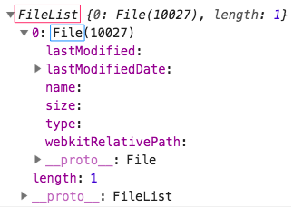

# Not Fancy Image Upload

A simple, not fancy at all, image upload.

**Features include:**

- Upload image through file input
- Drag and drop image upload
- Hosting image through `FileReader` API
- Simple image type validation
- Decorate image with border 
- Customize border color and thickness

**Built using:**

- Vue
- Google Fonts - Happy Monkey

<br>

Play around with it on [CodePen](https://codepen.io/samanthaming/pen/XBKBBv)  
Or see it live! [here](https://samanthaming.github.io/not-fancy-image-upload/)

<br>


# Notes

Here are the general steps to create your own Not Fancy Image Upload.

You need to understand 2 concepts in dealing with your image Upload.

To handle our image upload, we need to utilize 2 APIs:

**1. File API**

This will allow you to interact with your local files. The File API will give us access to a `FileList` which contains the `File` object. The `File` object will have all of the metadata about the image that was uploaded. It is what we will use to pass to our `FileReader`.



**2. FileReader API**

The `FileReader` API is what will allow use to create a local url that can be used as the `src` of our image element. It reads the content of our `File` object asynchronously. So we need to trigger the `onload` event when the load finishes, so we can access the `result` attribute that will our src url.

## A. Image Upload through File Input

### A-1: Load File with `input`

```html
<input 
  type="file" 
  @change="onFileChange" 
  accept="image/*">
```

### A-2: Handle the Image Upload

```javascript
methods: {
  onFileChange(e) {
    // Extract the FileList 
    const fileList = e.target.files;
    
    // Destructure the File from the Filelist
    const [file] = filesList;
    
    // Generate our src url with the FileReader API
    const reader = new FileReader();
    
    // Encode our file data as a "data url" (base64 format)
    reader.readAsDataURL(file);
    
    // Once the FileReader finish loading, 
    //  trigger the onload event to extract the url
    reader.onload = (e) => {
      this.imageUrl = e.target.result;
    }
  }
}
```

### A-3: Displaying the Image

```html

```

## B. Image Upload through Drag and Drop

We're going to utilize HTML Drag and Drop API to create a drop zone. The 2 events we're going to call are:

**dragover**: This event is fired when the dragged image is moving withint our drop zone.

**drop**: This event is fired when the user drops the image into our drop zone.

## B-1. Create our Drop Zone

```html
<div 
  @dragover.prevent 
  @drop.stop.prevent="dropImage"
></div>
```

## B-2. Handle the Dropped Image

```javascript
methods: {
  dropImage(e) {
    const fileList = this.validateImageFile(e.dataTransfer.files);
    
    // The rest follows the same step as #A-2
  }
}
```

### B-3: Displaying the Image

```html

```

## Centering Absolute Image

To center an image with position absolute. We need to use both the `transform` and `left` property.

CSS **left** property is based on the size of the parent element.  
CSS **transform** property is based on the the size of the target element.

left 50% will move the element exactly at the center of the main container where this element belongs! BUT translateX(50%) will move the element right exactly to 50% of its width,and NOT at the center of the whole Container element!

```css
.parent {
  position: relative;
}

img {
  position: absolute;
  
  /* This will move the element exactly at the center of the parent container */
  left: 50%;
  
  /* This will re-adjust the element right exactly to 50% of its own width */
  transform: translateX(-50%);
}
```

# Resources

- [CodePen: Select or drop image with Vuejs](https://codepen.io/raffo1234/pen/bZQXwZ)
- [JSFiddle: Image upload](https://jsfiddle.net/mani04/5zyozvx8/)
- [David Walsh: File Reader](https://davidwalsh.name/filereader)
- [David Walsh: File API](https://davidwalsh.name/file-api)
- [CodePen: Vue CSS Custom Property Test](https://codepen.io/richardtallent/pen/yvpERW/)
- [Reading files in JavaScript using the File APIs](https://www.html5rocks.com/en/tutorials/file/dndfiles/)
- [Stack Overflow: Why does “left: 50%, transform: translateX(-50%)” horizontally center an element?](https://stackoverflow.com/questions/25982135/why-does-left-50-transform-translatex-50-horizontally-center-an-element)
